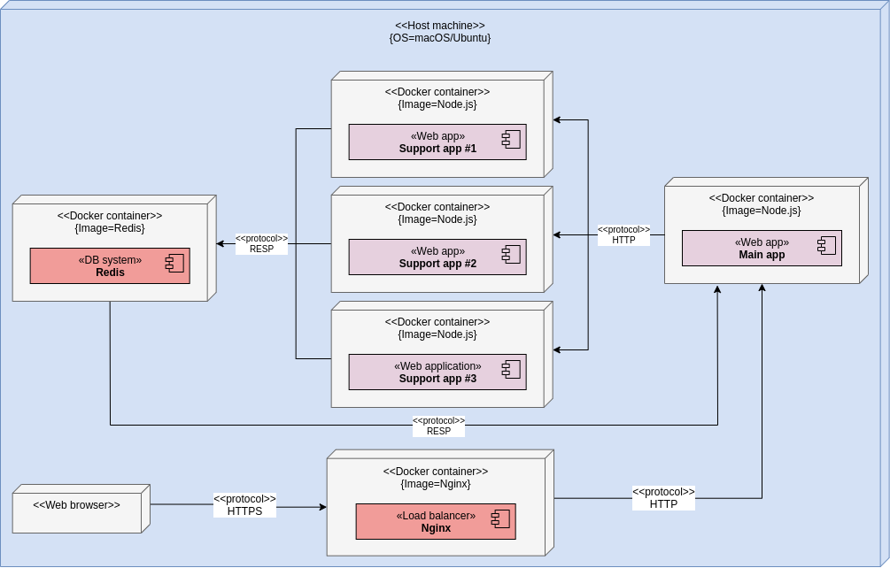

# Business logic application

This project contains the full business logic application.

## High level overview of components

## Prerequisites

In order to build and run the application locally on your machine, the following requirements must be met:

-   **OS**: macOS or Linux (tested on macOS 15.04 and Ubuntu 18.04.4)
-   **Software**:
    -   [GNU Make](https://www.gnu.org/software/make/) (version 3.81 =<)
    -   [Docker](https://docs.docker.com/install/) (version 19.03.8 =<)
    -   [Docker Compose](https://docs.docker.com/compose/install/) (version 1.25.3 =<)

## Connecting to DB access and logging applications
This setup can automatically connect to the [DB access](https://github.com/gucl-bachelor-project/db-access-app) and [logging](https://github.com/gucl-bachelor-project/logging-app) applications, while running it locally on your machine, as external Docker network references is set up to the other setups.
