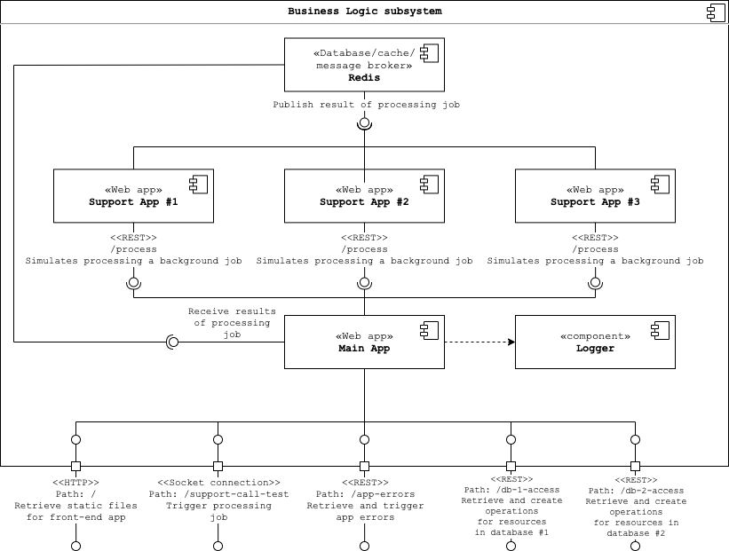

# Business Logic Subsystem

This repository contains the source code and configuration of the business logic subsystem (including a Nginx reverse
proxy) to be deployed on a server. The different components of the subsystem is run in Docker containers and
orchestration by the [Docker Compose tool](https://docs.docker.com/compose/).  
A UML component diagram illustrating all components and their dependencies is shown below:

## Application

### Ports

A frontend application (served by the _Main App_ component) is accessible on the following ports depending on the
environment:

-   Production: 80
-   Development: 8080

## Prerequisites

In order to build and run the application locally on your machine, the following requirements must be met:

-   **OS**: macOS or Linux (tested on macOS 15.05.5 and Ubuntu 18.04.4)
-   **Software**:
    -   [GNU Make](https://www.gnu.org/software/make/) (version >= 3.81)
    -   [Docker](https://docs.docker.com/install/) (version >= 19.03.8)
    -   [Docker Compose](https://docs.docker.com/compose/install/) (version >= 1.26.0)

## Connecting to Persistence and Logging subsystem

This setup can automatically connect to the [Persistence](https://github.com/gucl-bachelor-project/db-access-app)
and [Logging](https://github.com/gucl-bachelor-project/logging-app) subsystems, while running it locally on your
machine, as external Docker network references is set up to the other setups.

## Build and Publish Artifacts

Execute the following commands in this directory to build and publish the artifacts for production use:
`make prod-build` and `make prod-push`.  
As of now, the artifacts are published to this project's Docker image registry and object storage.
